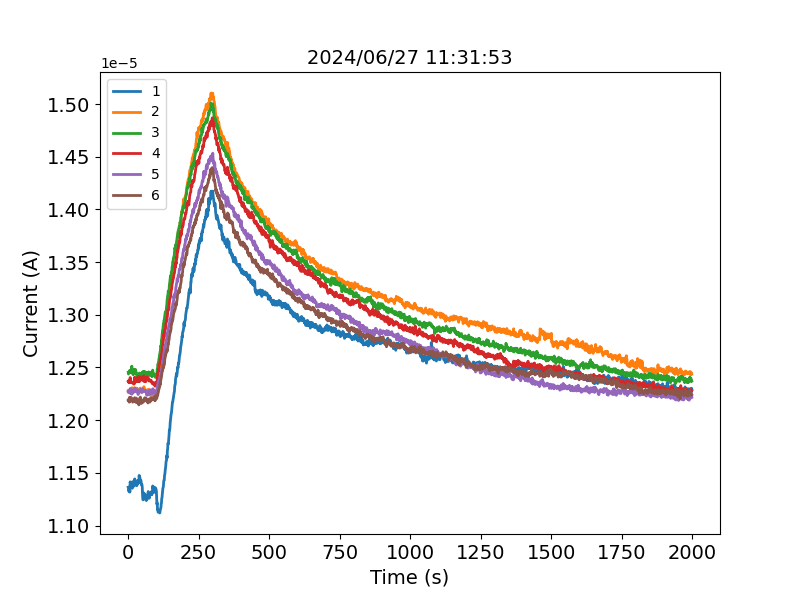
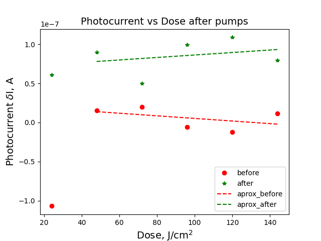

# summerschool_2024
Photocurrent measurements with Keythley 2636b and laser

The project was carried out by Anastasia Teplova, Agata Zhuravleva-Emelyanenko, Ivan Salimov and Arthur Arkhipov.

Project manager Petr Parfenov.

ITMO University, International Scientific and Educational Center for Physics of Nanostructures (PhysNano)

Example of experimental data:

Exapmle of calculated responces:

